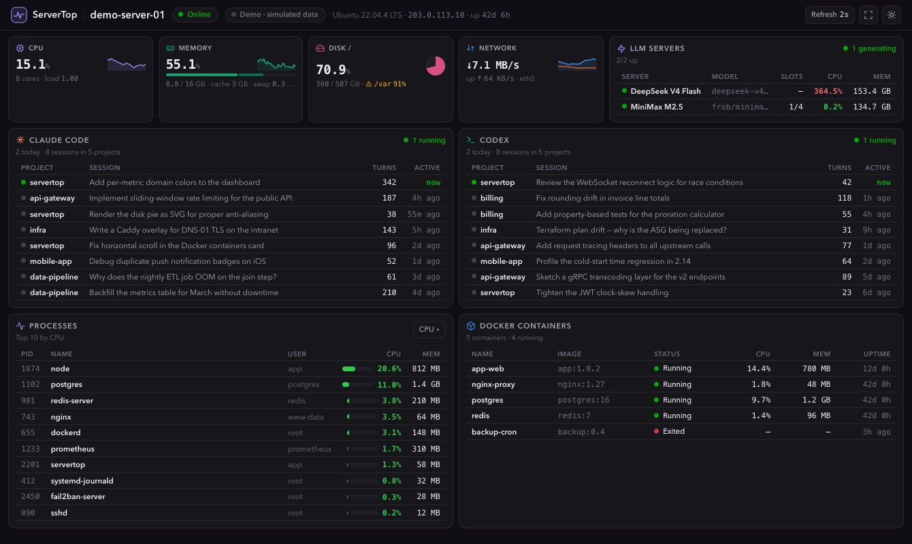
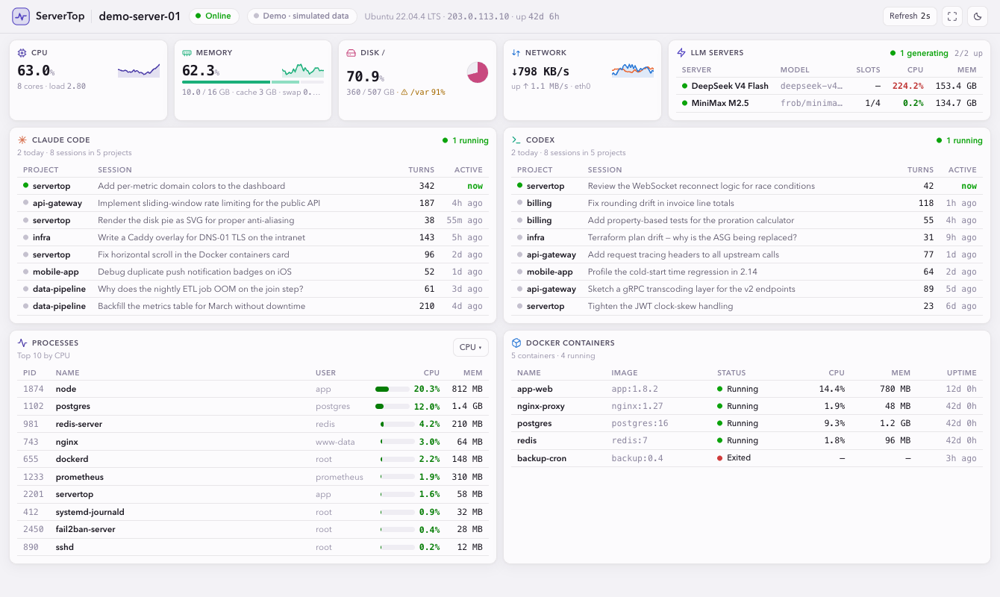

# ServerTop

A lightweight, self-hosted **single-server monitoring dashboard**. Run one Docker container on the server you want to watch, then open the dashboard from any browser — metrics stream in every 2 seconds over WebSocket.

**[Live demo →](https://newbdez33.github.io/servertop/?demo)** *(simulated data)*



<details>
<summary>Light theme</summary>



</details>

## Features

- **CPU** — total usage history, per-core bars, load average, temperature (when available)
- **Memory** — used / cache / free breakdown, swap
- **Disk** — per-partition usage with 85% / 95% warning states
- **Network** — download/upload rate charts for the default interface
- **Processes** — top consumers, sortable by CPU or memory
- **Docker containers** — state, CPU, memory, uptime
- **Claude Code & Codex sessions** — recent coding-agent sessions across
  projects with live "running" status (auto-enabled when `~/.claude` /
  `~/.codex` exist on the monitored host)
- **Configurable layout** — a server-side JSON file picks which cards show,
  their order, widths and row limits (the web UI stays read-only)
- **Live** — 2s WebSocket push, automatic reconnect, REST polling fallback
- **Token auth** — single access token → 24h JWT, login rate-limited
- **Read-only by design** — zero configuration surface in the web UI; everything is configured server-side via environment variables
- Light / dark theme, compact layout tuned for iPad landscape, English UI
- **Fullscreen & installable** — fullscreen toggle in the top bar; PWA manifest, so
  on iPad you can Share → *Add to Home Screen* for a chromeless standalone app
- **Self-updating pages** — open dashboards detect new deploys (5-min check +
  on wake) and reload themselves
- No database — history lives in a 1-hour in-memory ring buffer

## Quick start (Docker)

```bash
git clone https://github.com/newbdez33/servertop.git
cd servertop
# edit docker-compose.yml: set ACCESS_TOKEN to your own secret
docker compose up -d --build
```

Open `http://<server-ip>:3000` and sign in with your token.

### Why the compose file needs those privileges

A monitoring agent must see *through* container isolation. Each setting maps to a feature — remove it and that card loses data:

| Setting | Enables |
|---|---|
| *(none — `/proc` is not namespaced)* | CPU usage, memory, load average |
| `pid: host` | host process list |
| `network_mode: host` | host interface traffic (and direct port binding) |
| `/:/host:ro,rslave` | disk partition usage (paths rewritten from `/host/...`) |
| `/var/run/docker.sock:ro` | container list & stats |
| `/sys:ro` | CPU temperature |
| `/etc/os-release:ro` | host OS name |

> **Note:** the Docker socket effectively grants root-level visibility. ServerTop only reads from it, but treat the deployment accordingly. The container runs as root to read host paths — it binds one HTTP port and writes nothing.

## Configuration

Everything is configured through environment variables — the web UI is a pure read-only view.

| Variable | Default | Description |
|---|---|---|
| `ACCESS_TOKEN` | *(unset)* | Access token for login. **If unset, auth is disabled** (a warning is logged — trusted networks only). |
| `PORT` | `3000` | HTTP/WebSocket listen port |
| `SAMPLE_INTERVAL` | `2000` | Metrics sampling interval, ms |
| `HISTORY_WINDOW` | `3600` | Seconds of history kept in memory |
| `JWT_SECRET` | *(random)* | Pin this to keep sessions valid across restarts |
| `JWT_TTL` | `86400` | Session lifetime in seconds (e.g. `31536000` = 1 year for a wall-mounted dashboard; requires a pinned `JWT_SECRET` to survive restarts) |
| `ALLOWED_ORIGIN` | *(unset)* | Comma-separated origins allowed for cross-origin API access (e.g. `https://newbdez33.github.io` for the Pages-hosted frontend). Unset = same-origin only. |
| `LAYOUT_FILE` | `layout.json` | Path to the optional dashboard-layout JSON (see below) |
| `CLAUDE_DIR` | `~/.claude` | Claude Code data dir for the sessions card; card auto-hides when absent. Docker: mount `~/.claude:/app/.claude:ro` and set `CLAUDE_DIR=/app/.claude` |
| `CODEX_DIR` | `~/.codex` | Codex CLI data dir for the sessions card; same auto-hide and Docker mount pattern |

### Dashboard layout (optional)

Which cards show, their order, width and list length are configurable with a JSON
file **on the server** — the web UI stays a pure read-only view. Copy
[`layout.example.json`](layout.example.json) to `layout.json`, edit, and restart.
In Docker, mount it (uncomment the line in `docker-compose.yml`):

```yaml
- ./layout.json:/app/layout.json:ro
```

Example — hide the network chart and Docker card, full-width CPU chart, 10 processes:

```json
{
  "cards": [
    "cpu-tile", "memory-tile", "disk-tile", "network-tile",
    { "id": "cpu-chart", "span": 12 },
    "memory", "disk", "system",
    { "id": "processes", "span": 12, "limit": 10 }
  ]
}
```

- Cards render in array order; **omitted cards are hidden**.
- `span` — card width on large screens in a 12-column grid (phones always stack).
- `limit` — max rows for the list cards (`processes`, `docker`).
- Card ids: `cpu-tile` `memory-tile` `disk-tile` `network-tile` `cpu-chart`
  `network-chart` `memory` `disk` `system` `processes` `docker` `claude` `codex`
  (the agent cards are not in the default layout — add them to your `layout.json`,
  e.g. side by side with `{"id": "claude", "span": 6}` + `{"id": "codex", "span": 6}`).
- Missing file → default layout; invalid entries are skipped with a server-log warning.

**Network exposure:** ServerTop is designed for intranet/VPN use over plain HTTP. If you must expose it publicly, put a TLS-terminating reverse proxy in front (remember to forward WebSocket `Upgrade` headers).

## Hosted frontend (GitHub Pages) + HTTPS backend

Instead of serving the UI from the container, you can use the frontend hosted at
**https://newbdez33.github.io/servertop/** and point it at your own server. Because
that page is HTTPS, the browser requires the backend to be HTTPS too (mixed-content
policy). The included Caddy overlay gets a real Let's Encrypt certificate via
**DNS-01** — your server stays intranet-only, nothing is exposed to the internet
(Caddy binds `:443` on the intranet; port 80 is not used):

1. **DNS**: create an A record, e.g. `monitor.example.com` → your server's *intranet* IP,
   and get an API token for your DNS provider (needed for the DNS-01 challenge).
2. **Configure** `docker-compose.https.yml`: set `SERVERTOP_DOMAIN`, `DNS_API_TOKEN`,
   and `ALLOWED_ORIGIN` (the frontend origin). The default build uses the Cloudflare
   DNS module — for another provider change `DNS_PLUGIN` and the `dns` line in
   [`deploy/caddy/Caddyfile`](deploy/caddy/Caddyfile) (see [caddy-dns](https://github.com/caddy-dns)).
3. **Run**:

   ```bash
   docker compose -f docker-compose.yml -f docker-compose.https.yml up -d --build
   ```

4. Open `https://newbdez33.github.io/servertop/`, enter `https://monitor.example.com`
   as the Server URL, and sign in. The server address is stored in your browser
   (a client-side setting — the server itself still has no web-configurable state).

## API

All endpoints require `Authorization: Bearer <jwt>` (obtained from `/api/auth/login`) unless auth is disabled.

| Method | Path | Description |
|---|---|---|
| POST | `/api/auth/login` | `{ "token": "..." }` → `{ token, expiresIn }` |
| GET | `/api/auth/status` | `{ required }` |
| GET | `/api/system` | Static host info |
| GET | `/api/metrics` | Current snapshot |
| GET | `/api/metrics/history?range=3m\|5m\|15m\|1h` | History points |
| GET | `/api/processes?sort=cpu\|mem&limit=10` | Top processes |
| GET | `/api/docker` | Containers |
| GET | `/api/claude` | Claude Code sessions |
| GET | `/api/codex` | Codex sessions |
| WS | `/ws?token=<jwt>` | `{type: metrics\|processes\|containers\|claude\|codex, data}` pushes |

## Development

```bash
npm install
npm run dev:server   # Express + collector on :3000 (tsx watch)
npm run dev:web      # Vite dev server on :5173, proxies /api and /ws
```

Running the server natively (macOS/Linux) works for development — it reads whatever host it's on. The `/host` path rewriting only activates inside the Docker deployment.

```
server/   Express 5 + ws + systeminformation (TypeScript, ESM)
web/      React 19 + Vite 7 + Tailwind CSS v4
shared/   Type contracts shared by both
```

Design doc (architecture, milestones): [`docs/DESIGN.md`](docs/DESIGN.md) · UI prototype: [`preview/ui-preview.html`](preview/ui-preview.html)

## License

[MIT](LICENSE)
